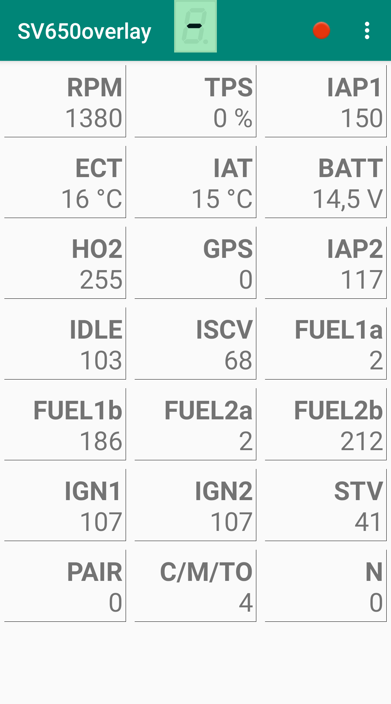
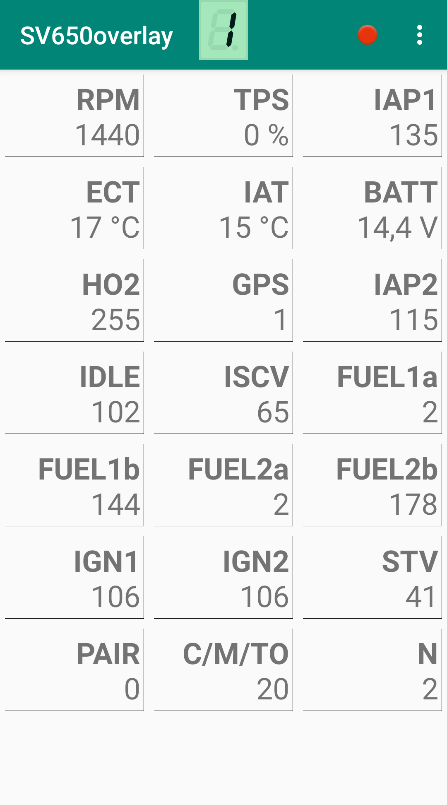

# SV650overlay
Suzuki SV650AK7 motorcycle gear indicator and diagnostic data monitor using an ESP32, an Android app and Bluetooth connectivity

## Features
* ESP32 reads diagnostic sensor data from bike ECU via K-Line (SDS protocol) and sends it via Bluetooth
* Android smartphone app receives, processes, displays and optionally records the data in csv format
  * Background service handles Bluetooth connection, receives data and processes gear information for overlay
  * Movable overlay displays current gear and connection status in 7-segment display look, on top of all other apps (e.g. navigation, music player)
  * App screens/activities to discover Bluetooth devices, control the background service, display and record data
  

Screenshots (click to expand)

   </img>
   </img>
  

## Motivation
The Suzuki SV650 has no built-in gear indicator. If you want to have one, there are several solutions, e.g. modifying the speedo with a Multibot or buying an external gear position indicator. Neither soldering the speedo nor paying much money for another attachment to the handlebars satisfied me, so I looked for alternatives.  
First finding was https://github.com/RaysceneNS/SV-650-GearPositionIndicator - an attempt to read the gear position sensor analog voltage directly with an ATtiny microcontroller. I built, but never installed it because I thought it could influence the signal for the ECU.  
Later I found https://github.com/o5i/Datalogger - an Arduino based datalogger using the diagnostic interface of the bike (which is K-Line aka ISO 9141 with Suzuki specific KWP2000 aka ISO 14230 protocol implementation, called SDS). I had an ESP32 flying around for some time, so the idea of building something with wireless connectivity and an Android smartphone, which already had its place on my handlebars, grew. I flashed Arduino core for ESP32 and adapted the code for my needs and hardware (ESP32 with Bluetooth, SV650AK7).
So here it is now - some conversions are still missing or inaccurate, but it is working overall.

## Hardware
* ESP32-DevKitC (WROOM32)
* DSN-MINI-360 DC-DC buck converter board (DevKit's LDO gets very hot when running with bike's voltage and capacitors are designed for max. 10 volts, as I found out after some cutouts ... so this steps voltage down to 5 volts for the ESP32 first)
* ST L9637D Monolithic bus driver with ISO 9141 interface
  * Tx/Rx pins are connected to ESP32 UART2 (hardware serial, GPIO 16/17, Pin 25/27)
* Diode 1N4007 (input)
* Resistor 510 Ohm (K-Line pull-up)
* For schematics, refer to https://github.com/iwanders/OBD9141 and https://github.com/aster94/Keyword-Protocol-2000 (works fine for me with one diode and without the capacitors)
* 6-pin MT .090 Sealed connector (diagnostic interface of the bike)
  * Diagostic connector pinout (base color/line color):
    * Black/white: GND
    * Orange/green: switched +12V
    * White/red: Dealer mode (when connected to GND)
    * Gray/red: K-Line

## Software
* ESP32 firmware (Arduino sketch)
  * Arduino core for ESP32 https://github.com/espressif/arduino-esp32
* Android app
  * Android Studio and SDK tools https://developer.android.com/studio/

## Additional Information
* Tested on Android 9
* Designed for Sony Xperia XZ2 Compact screen (resolution 1080x2160 px FHD+)
* Recorded log files are stored in internal storage (/storage/emulated/0/Android/data/de.bananajoh.sv650overlay/files/)
* K-Line post frame delay (T_04) was increased to 200 ms (initially 50 ms), so the resulting refresh rate is about 3-4 Hz instead of 6-7 Hz - reducing load on ESP32 (cutouts when air temperature was high) and log file size

## References
* SDS protocol thread on ECU hacking forum: https://ecuhacking.activeboard.com/t22573776/sds-protocol/
* 7-segment display images: http://avtanski.net/projects/lcd/
* Similar project: https://github.com/synfinatic/sv650sds
* Similar project for Kawasaki: https://github.com/HerrRiebmann/KDS2Bluetooth
